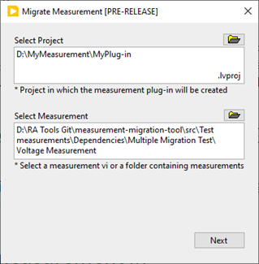
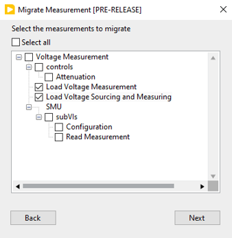
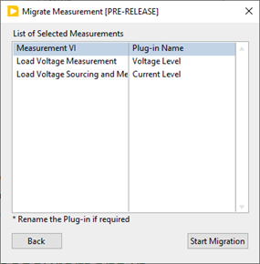
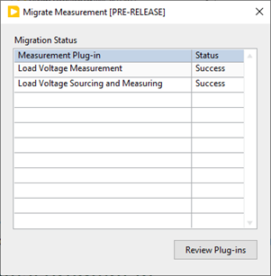
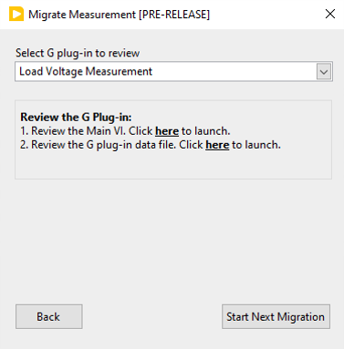

# G Plug-In SDK for LabVIEW

- [G Plug-In SDK for LabVIEW](#g-plug-in-sdk-for-labview)
  - [Introduction](#introduction)
  - [Software support](#software-support)
  - [Installation](#installation)
  - [Developing a LabVIEW measurement](#developing-a-labview-measurement)
  - [Migrating existing measurement into G Plugin](#migrating-existing-measurement-into-g-plugin)
  - [Using the measurement in InstrumentStudio](#using-the-measurement-in-instrumentstudio)
  - [Building and Deploying Release Plug-in](#building-and-deploying-release-plug-in)

---

## Introduction

The G Plug-In SDK for LabVIEW packages enable measurement developers to quickly create LabVIEW measurements and host them in InstrumentStudio. G  Plug-In Support allows users to interact with measurement with a LabVIEW UI in InstrumentStudio.

---

## Software support

- InstrumentStudio 2024 Q3 or later
- LabVIEW 2021 SP1 or later
  - JKI VI Package Manager 2021 SP1 or later

---

## Installation

1. Install a supported version of
   [InstrumentStudio](https://www.ni.com/en/support/downloads/software-products/download.instrumentstudio.html#494650)
2. Install a supported version of
   [LabVIEW](https://www.ni.com/en/support/downloads/software-products/download.labview.html#487445)
3. Install the [G Plug-in SDK](https://github.com/ni/g-plugin-labview/releases/download/v2.0.0.2/ni_lib_g_plugin_sdk-2.0.0.2.vip), followed by the [G Plug-in SDK Generator](https://github.com/ni/g-plugin-labview/releases/download/v2.0.0.2/ni_lib_g_plug_in_sdk_generator-2.0.0.2.vip)

---

## Developing a LabVIEW measurement

1. Create and save a new LabVIEW project.

2. From the project window, go to `Tools` → `Plug-In SDKs` → `G Plug-in` → `Create G Plug-in...`.
    - In the dialog, enter the `G Plug-in Name` and `G Plug-in Group`, then click `Create G Plug-in`.

        

    - This will create a new measurement service library and a UI library.

        

3. Check G plug-in Components for more details on the components
4. Edit the `Main.vi` and implement the measurement logic in the block diagram

## Migrating existing measurement into G Plugin

1. From the project window, go to `Tools` → `Plug-In SDKs` → `G Plug-in` → `Migrate Measurement...`.
    - In the dialog, enter the `Project Path`, enter the folder `Select the Measurement VI` and click `Next`
  
      

    - Check the measurement which should be migrated and click `Next`

      

    - Rename the plug-in name and click `Start Migration`

      

    - The status of the migration will be shown. Click `Review plug-ins` to review and verify the migration measurement

      

    - Review the migrated plugins

      

## Using the measurement in InstrumentStudio

1.	Open the measurement project
2.	The generated plug-in comes with a Packed Project Library(PPL) build specification. Build the PPL
3.	Copy all the build output files and place the files in the C:\Program Files\National Instruments\InstrumentStudio\Addons\<PluginName>
4.	Open InstrumentStudio and click Manual Layout.
5.	Choose the desired plug-in and create a large panel.

      

---

## Building and Deploying Release Plug-in

1.	Create a NI Package or Installer build specification in LabVIEW. Refer this [creating build specification](https://www.ni.com/docs/en-US/bundle/labview/page/building-and-distributing-applications.html) for more info.
2.	Add the PPL as the source file.
3.	Set the destination directory to `C:\Program Files\National Instruments\InstrumentStudio\Addons\<Plug-inName>`
4.	Build the NI Package or Installer

---

For more information of G Plugin components refer [G Plugin Guide](https://github.com/ni/g-plugin-labview/releases/download/v2.0.0.2/G_Plugin_Guide.pdf)