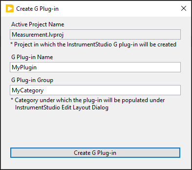
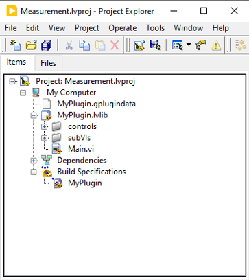
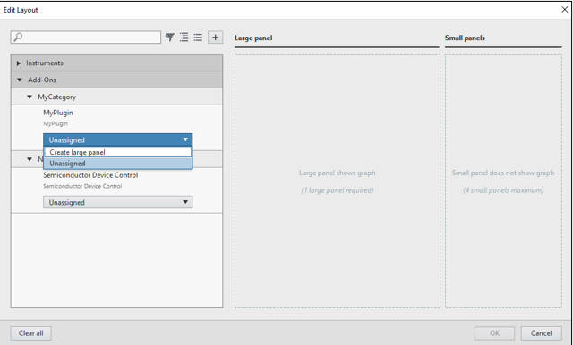

# G Plug-In SDK for LabVIEW

- [G Plug-In SDK for LabVIEW](#g-plug-in-sdk-for-labview)
  - [Introduction](#introduction)
  - [Software support](#software-support)
  - [Installation](#installation)
  - [Developing a LabVIEW G Plug-in application](#developing-a-labview-g-plug-in-application)
  - [Using the G Plug-ins in InstrumentStudio](#using-the-g-plug-ins-in-instrumentstudio)
  - [Building and Deploying release Plug-in](#building-and-deploying-release-plug-in)

---

## Introduction

The G Plug-In SDK for LabVIEW allows users to integrate custom LabVIEW applications directly into the InstrumentStudio environment. This integration enables users to enhance the functionality of InstrumentStudio by adding custom measurements, controls, and displays tailored to their specific needs. G Plug-In support allows users to interact with LabVIEW applications from InstrumentStudio soft panel.

---

## Software support

- InstrumentStudio 2024 Q3 or later
- LabVIEW 2021 SP1 or later
  - JKI VI Package Manager 2021 SP1 or later

---

## Installation

1. Install a supported version of
   [InstrumentStudio](https://www.ni.com/en/support/downloads/software-products/download.instrumentstudio.html#544066)
2. Install a supported version of
   [LabVIEW](https://www.ni.com/en/support/downloads/software-products/download.labview.html#443865)
3. Install the [G Plug-in SDK](ADD-PACKAGE-LINK), followed by the [G Plug-in SDK Generator](ADD-PACKAGE-LINK)

---

## Developing a LabVIEW G Plug-in application

1. Create and save a new LabVIEW project.

2. From the project window, go to `Tools` → `Plug-In SDKs` → `G Plug-in` → `Create G Plug-in...`.
    - In the dialog, enter the `G Plug-in Name` and `G Plug-in Group`, then click `Create G Plug-in`.

        

    - This will create a new LabVIEW library and a .gplugindata file.

        

3. Refer to G Plug-in components section in the [G Plug-in guide](https://github.com/ni/g-plugin-labview/releases/download/v1.0.0.1/G_Plug-in_Guide.pdf) for more details on the components.
4. Open the `Main.vi` and add the logic / implement the application.

## Using the G Plug-ins in InstrumentStudio

1. Open the LabVIEW project.
2. The generated plug-in comes with a Packed Project Library(PPL) build specification. Build the PPL.
3. Copy all the build output files and place them in the `C:\Program Files\National Instruments\InstrumentStudio\Addons\<Plug-in Name>`
4. Open InstrumentStudio and click Manual Layout. All the G plug-ins are listed under Add-Ons category.
5. Choose the desired plug-in and create a large panel.

      

---

## Building and Deploying release Plug-in

1. Create a NI Package or Installer build specification in LabVIEW. Refer this [creating build specification](https://www.ni.com/docs/en-US/bundle/labview/page/building-and-distributing-applications.html) for more info.
2. Add the PPL as the source file.
3. Set the destination directory to `C:\Program Files\National Instruments\InstrumentStudio\Addons\<Plug-in Name>`
4. Build the NI Package or Installer

---

For more information of G Plug-in components refer [G Plugin Guide](ADD-GUIDE-LINK-POST-RELEASE)
